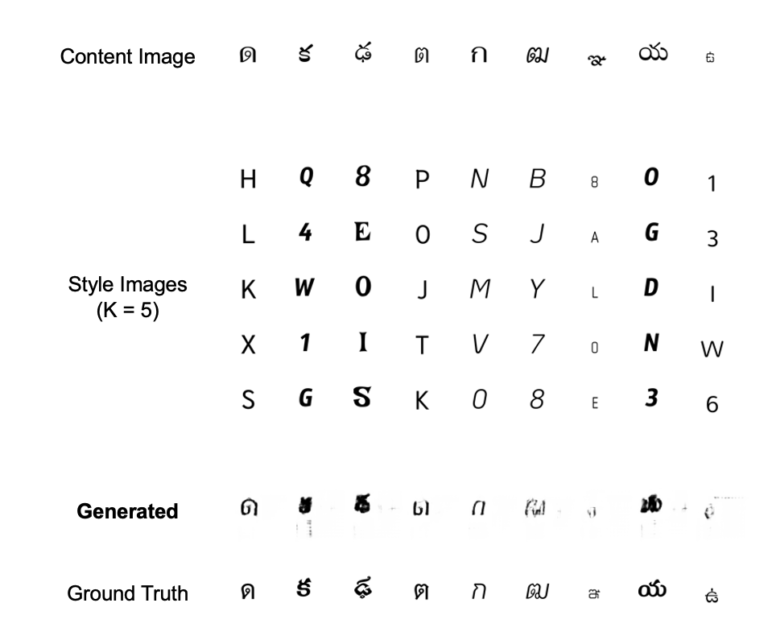

# Font Style Transfer across multiple languages

This is an unofficial implementation for the paper [Few-shot Font Style Transfer between Different Languages](https://openaccess.thecvf.com/content/WACV2021/papers/Li_Few-Shot_Font_Style_Transfer_Between_Different_Languages_WACV_2021_paper.pdf). The original implementation from the author can be found [here](https://github.com/ligoudaner377/font_translator_gan).

## News

### 🤗 Hugging Face Space demo is out!
[deepkyu/multilingual-font-style-transfer](https://huggingface.co/spaces/deepkyu/multilingual-font-style-transfer)

`2023.09.29` I newly update the code and train the model to support Korean, Japanese, and Chinese characters. The training code has not yet updated in this repo since I have no time to integrate with this code. But I made a Hugging Face Space to show you whether the current "Multilingual Font Style Transfer" makes sense or not. 
I'll update whenever possible til we can get more established font style transfer model which can support the next multilingual society!

## Setup

### Requirements

See [requirements.txt](./requirements.txt)

### Checkpoints

Download pretrained checkpoints for the evaluation to [`pretrained`](./pretrained/) directory.

- [ftgan_vanilla_best.ckpt](https://drive.google.com/file/d/1Gex2gYt1EYtSDckldgB0F5sqJs2XPpl4/view?usp=share_link)
- [google_font_best.ckpt](https://drive.google.com/file/d/1BE-W1qnscGnuMN5yNRADVJl-qB0NmucB/view?usp=share_link)

### Data

For FTransGAN original data, you can download at [the official repository](https://github.com/ligoudaner377/font_translator_gan).

For our multilingual dataset, you can download at [our google drive link](https://drive.google.com/file/d/1VAeBmoAF__LIIvte-megsNGN5DzexY0_/view?usp=share_link).

Please locate in [`data/ftgan-fonts`](./data) and [`data/google-fonts`](./data) for each. 

## Cheatsheet

### Train

```!bash
python trainer.py
```

### Evaluation

For the result of FTrasnGAN and its data,

```!bash
bash evaluate-ftgan.sh
```

The default option is with `test_unknown_content`. You can change it in [`config/datasets/ftgan.yaml`](./config/datasets/ftgan.yaml) by switching the value from `True` to `False`. (If `False`, it evaluates with `test_unknown_style`.)

For the result of Google Fonts data,

```!bash
bash evaluate-google-font.sh
```

## Updates

`2022.12.04`

This code is a part of my final term project in _Special Topics in Computer Science - Introduction to Deep Learning (CS492I)_ (2022 Fall, KAIST).  
The goal of my proposal is to generate novel fonts for a certain language, whose style is transferred from fonts for other languages.  
In this project, I used [google/font](https://github.com/google/fonts) repository to define [Google Fonts](https://fonts.google.com/) dataset, which contains font images from 10 different languages.  

However, I failed to introduce the font generation models for unseen languages. Instead, I'll share some results in training dataset to explain the core concept of this project.

Hope that I could finish this project successfully in some days :)

## Main concept




## To be continued...

- [x] finish the military service in South Korea
- [ ] finish the undergraduate course and (might) go to graduate school...
